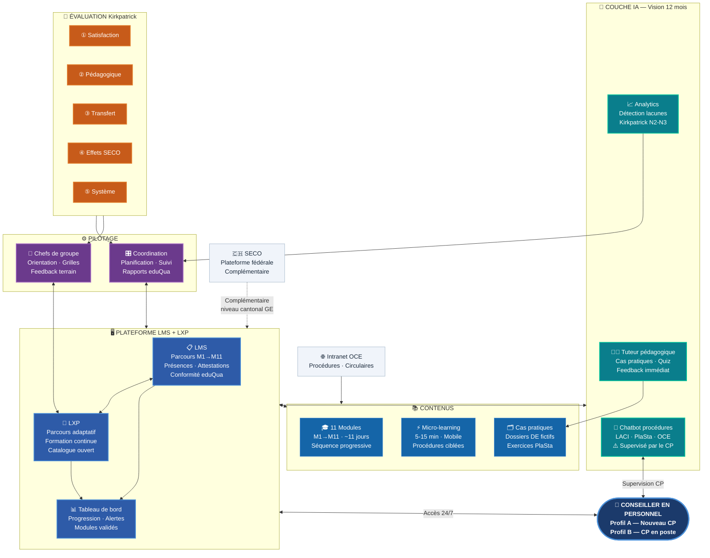
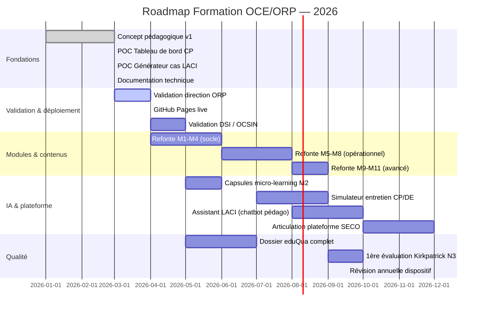

# Formation OCE/ORP Genève — Dispositif Numérique

> **Coordination ORP — Pôle Formation** · Version 1.0 · Mars 2026  
> Concept pédagogique · Architecture IA · Preuves de concept

---

## Vision

Ce dépôt documente le **dispositif de formation numérique des Conseillers en Personnel (CP)** de l'ORP Genève — un projet de transformation qui articule pédagogie active, intelligence artificielle et architecture évolutive.

**Deux niveaux de formation :**
- 🔵 **Formation de base** — Parcours M1→M11 (~11 jours), nouveaux CP
- 🟢 **Formation continue** — Catalogue ouvert, CP en poste

**Complémentaire à la plateforme SECO** — Ce dispositif couvre le niveau cantonal genevois : LMC, CII, partenaires locaux, spécificités terrain GE.

---

## Démos en ligne

| POC | Description | Lien |
|-----|-------------|------|
| 🗺️ **Tableau de bord CP** | Suivi du parcours M1→M11, prérequis, persistance | [Voir la démo](#) |
| 🎲 **Générateur de cas LACI** | Dossiers DE fictifs avec correction IA | [Voir la démo](#) |

> Les POCs fonctionnent dans Claude.ai Artifacts — aucune installation requise.

---

## Architecture de l'écosystème



---

## Les 11 modules — Formation de base

| # | Module | Durée | Domaine | Prérequis |
|---|--------|-------|---------|-----------|
| M1 | Accueil & Intégration | ½ j | Institutionnel | — |
| M2 | Assurance-chômage (LACI) | 1 j | Légal | M1 |
| M3 | PlaSta & GED | 1½ j | Outils | M1, M2 |
| M4 | Outils métier | 1 j | Outils | M3 |
| M5 | Événements & Réinsertion | 1 j | Opérationnel | M3, M4 |
| M6 | Périodes de contrôle & Absences | 1 j | Opérationnel | M5 |
| M7 | Placement & Gain intermédiaire | 1 j | Opérationnel | M5, M6 |
| M8 | Mesures du marché du travail | 1 j | Opérationnel | M5 |
| M9 | Manquement & Aptitude | ½ j | Légal | M6, M7 |
| M10 | Situations spécifiques & CII | 1 j | Partenarial | M7–M9 |
| M11 | Restitution & Autoévaluation | ½ j | Évaluation | M1–M10 |
| **Total** | | **~11 jours** | | |

---

## Vision IA — 3 niveaux · Fil rouge transversal

L'IA ne rend pas obsolètes les procédures, la LACI ou PlaSta. Elle les réoriente : on ne les enseigne plus pour que le CP les mémorise, mais pour qu'il en comprenne la logique et les limites — de sorte qu'il puisse exercer son jugement quand la situation s'écarte de la norme, quand l'outil se trompe, quand la règle rencontre le cas particulier.

C'est cette différence — entre appliquer une procédure et comprendre pourquoi elle existe — qui distingue un technicien de procédure d'un professionnel du placement. L'IA ne comble pas cet écart. Elle le creuse, en prenant en charge la partie mécanique du travail et en laissant au CP exactement ce que la machine ne peut pas faire : décider en situation, avec du discernement.

```
┌─────────────────────────────────────────────────────────────┐
│  Niveau 1 — UTILISER          Horizon : maintenant          │
│  L'IA comme outil de travail                                │
│  Rédaction PV · Recherche LACI · Chatbot procédures OCE     │
├─────────────────────────────────────────────────────────────┤
│  Niveau 2 — SUPERVISER        Horizon : 6 mois              │
│  L'IA comme appui au jugement                               │
│  Évaluer les réponses IA · Détecter les erreurs             │
├─────────────────────────────────────────────────────────────┤
│  Niveau 3 — EXERCER SON JUGEMENT   Horizon : 12 mois        │
│  Là où l'IA ne suffit pas                                   │
│  Entretiens complexes · Décisions sous responsabilité       │
└─────────────────────────────────────────────────────────────┘
```

---

## Roadmap 12 mois



---

## Stack technique

| Couche | Outil | Rôle |
|--------|-------|------|
| Interface POCs | React 18 + Tailwind CSS | Composants UI, état local |
| IA générative | Claude API (claude-sonnet-4-20250514) | Génération cas LACI, feedback |
| Persistance | Claude.ai Storage API | Données entre sessions |
| Versioning | **GitHub** (ce dépôt) | Code · docs · assets |
| Déploiement POC | Claude.ai Artifacts | Démo immédiate |
| Déploiement futur | GitHub Pages / DSI GE | Production institutionnelle |

---

## Structure du dépôt

```
oce-orp-formation/
├── README.md                          ← Ce fichier
├── CHANGELOG.md                       ← Historique des versions
├── concept/
│   ├── Concept_Formation_v1.3.docx    ← Concept pédagogique complet
│   └── Presentation_OCE_ORP.pptx      ← Présentation direction
├── poc/
│   ├── tableau-de-bord/
│   │   ├── README.md
│   │   └── TableauDeBord.jsx          ← POC 1 — code source
│   └── generateur-cas-laci/
│       ├── README.md
│       └── GenerateurCas.jsx          ← POC 2 — code source
├── docs/                              ← GitHub Pages (ce site)
│   ├── index.html
│   └── assets/
├── modules/                           ← Fiches de cours (à venir)
│   ├── M01_Accueil/
│   ├── M02_LACI/
│   └── ...
└── qualite/                           ← Dossier eduQua (à venir)
    ├── Referentiel_competences.docx
    └── Grilles_evaluation.docx
```

---

## Positionnement par rapport à la plateforme SECO

| Dimension | Plateforme SECO | Dispositif OCE/ORP GE |
|-----------|----------------|----------------------|
| Périmètre | Fédéral — tous cantons | Cantonal — spécificités GE |
| Contenu | Socle commun AC | LMC · CII · partenaires locaux |
| Format | Asynchrone · à distance | Présentiel + numérique |
| Pédagogie | Standardisée | Active · adaptée terrain GE |
| IA | À confirmer | Intégrée dès maintenant |
| Relation | Complémentaire | Précurseur → contributeur |

> **Position stratégique :** Genève arrive à la table du SECO avec un dispositif cantonal opérationnel. Pas concurrent — complémentaire et enrichissant.

---

## Cadre qualité

- ✅ **eduQua 2021** — 6 critères documentés
- ✅ **Kirkpatrick/Meignant** — 5 niveaux d'évaluation
- ✅ **LPD/LIPAD** — aucune donnée personnelle DE dans les POCs
- ✅ **Accord de prestations OCE** — ancrage institutionnel

---

## Contact

**Coordination ORP — Pôle Formation**  
Office cantonal de l'emploi — Genève  
Département de l'économie et de l'emploi (DEE)

---

*Document vivant — révisé à chaque évolution du dispositif.*  
*Version 1.0 · Mars 2026*
